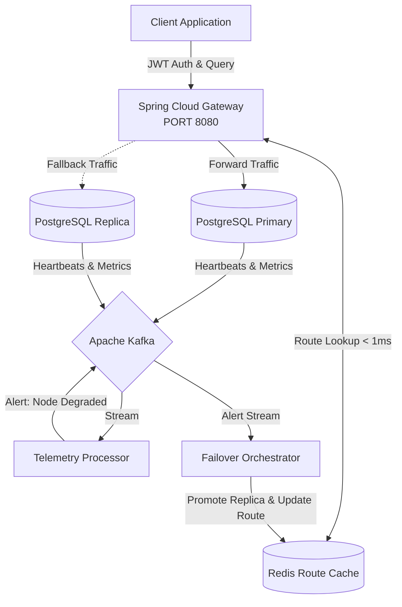

<div align="center">
  
# 🌐 AuraDB Control Plane
**Cloud-Native Autonomous DBaaS Routing Engine & Failover Orchestrator**

[](https://spring.io/projects/spring-boot)
[](https://docs.spring.io/spring-framework/reference/web/webflux.html)
[](https://kafka.apache.org/)
[](https://redis.io/)
[](https://www.docker.com/)

*A distributed systems project demonstrating enterprise-grade microservices, reactive programming, and self-healing infrastructure.*

</div>

---

## 📖 Overview

AuraDB is a **Database-as-a-Service (DBaaS)** control plane. In massive cloud environments (like AWS RDS or Snowflake), thousands of enterprise tenants spin up database instances. If one instance degrades or crashes, applications go down.

AuraDB acts as the "brain" between client applications and physical databases. It dynamically routes traffic to the correct tenant shard, monitors database heartbeats via Apache Kafka, and automatically executes zero-downtime failovers when a node crashes.

### ✨ Key Features
*   **Reactive High-Concurrency:** Built entirely on Spring WebFlux and Project Reactor to handle thousands of concurrent queries without thread starvation.
*   **Sub-Millisecond Dynamic Routing:** Intercepts traffic at the Gateway and uses an in-memory Redis cache to dynamically route requests to the correct physical database instance.
*   **Event-Driven Telemetry:** Database nodes stream CPU, RAM, and Latency metrics to Kafka, processed asynchronously.
*   **Autonomous Self-Healing:** Automatically promotes read-replicas and updates network routes within 60 seconds of detecting a dead database node.
*   **Multi-Tenancy:** Complete logical and physical isolation of customer data.

---

## 🏗️ Architecture



---

## 🚀 Quick Start (Docker)

You don't need Java or Maven installed on your host machine. The entire infrastructure and Spring Boot microservices are containerized using **multi-stage Docker builds**.

```bash
# 1. Clone the repository
git clone https://github.com/yourusername/auradb.git
cd auradb

# 2. Spin up the entire distributed system
docker-compose up --build -d

# 3. View the logs of the Control Plane
docker-compose logs -f control-plane
```

### Test the Control Plane
Once the system is up, you can register a new tenant:
```bash
curl -X POST http://localhost:8081/api/v1/tenants \
  -H "Content-Type: application/json" \
  -d '{"id": "netflix", "name": "Netflix Inc.", "plan": "enterprise"}'
```

---

## 🛠️ Technology Stack

| Component | Technology | Purpose |
| :--- | :--- | :--- |
| **API Framework** | Spring WebFlux / Project Reactor | Non-blocking, event-loop HTTP processing |
| **Edge Gateway** | Spring Cloud Gateway | Traffic routing, JWT validation, Circuit breaking |
| **Fast Data** | Redis (Reactive) | O(1) route lookups and caching |
| **Event Streaming**| Apache Kafka | Telemetry ingestion, node alerts, heartbeats |
| **Persistence** | PostgreSQL (R2DBC) | Durable tenant metadata storage |
| **Deployment** | Docker & Docker Compose | Multi-stage builds and local infrastructure |

---

## 🗺️ Project Roadmap

This project is built in iterative phases, proving mastery over different distributed system concepts:

- **Phase 1: Foundation:** Multi-module Maven, Java 21 Records, Reactive Control Plane API, and multi-stage Docker builds.
- **Phase 2: Redis Routing:** Storing and retrieving dynamic route maps in-memory.
- **Phase 3: Edge Gateway:** Intercepting requests and rewriting URLs dynamically based on Redis lookups.
- **Phase 4: Kafka Telemetry:** Producers mimicking DB nodes, consumers evaluating health metrics.
- **Phase 5: Automated Failover:** Real-time route swapping when a node goes down.
- **Phase 6: Security:** Protecting the gateway with JWT authorization.

---

<div align="center">
  <i>"Expect failure as a given, and engineer resilience as a standard."</i>
</div>
